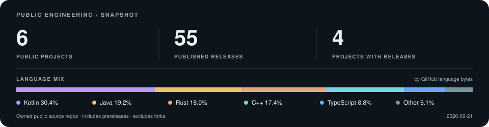

<picture>
  <source media="(max-width: 600px) and (prefers-color-scheme: light)" srcset="assets/hero-light-compact.svg">
  <source media="(max-width: 600px)" srcset="assets/hero-dark-compact.svg">
  <source media="(prefers-color-scheme: light)" srcset="assets/hero-light.svg?v=2">
  
</picture>

### Selected work

| Project | What it does |
| :--- | :--- |
| [**Auris**](https://github.com/bglglzd/3uxo) | Local recording, transcription & AI meeting notes. |
| [**UXO**](https://github.com/bglglzd/uxo) | On-device dictation for Windows. Press, speak, paste. |
| [**CipherBoard**](https://github.com/bglglzd/CipherBoard) | Offline encrypted Android keyboard with QR pairing. |
| [**Agent Workflows**](https://github.com/bglglzd/agent-workflows) | Reusable workflows for AI coding agents. |
| [**bugkit**](https://github.com/bglglzd/bugkit) | Context-rich bug reports for AI-assisted development. |

**Upstream:** [prompts.chat — pagination validation & bounds, merged ↗](https://github.com/f/prompts.chat/pull/1223)

<picture>
  <source media="(max-width: 600px) and (prefers-color-scheme: light)" srcset="assets/engineering-light-compact.svg">
  <source media="(max-width: 600px)" srcset="assets/engineering-dark-compact.svg">
  <source media="(prefers-color-scheme: light)" srcset="assets/engineering-light.svg">
  
</picture>

[About these numbers](docs/metrics.md) · [All public projects](https://github.com/bglglzd?tab=repositories&amp;type=source) · [Let's build something useful ↗](https://github.com/bglglzd/bglglzd/discussions)
